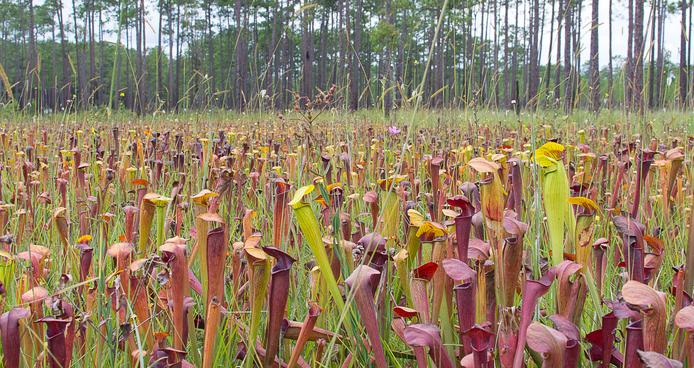
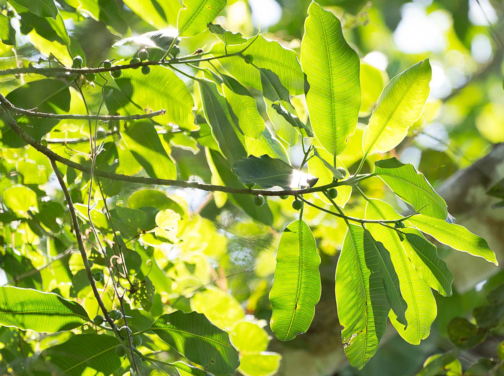

I am an evolutionary biologist interested in how ecological interactions among species contribute to generating patterns of diversification, the processes structuring genetic variation within and among species, and the mechanisms promoting speciation and governing reproductive isolation. I primarily study arthropods (and the plants with which they interact), where a wide range of life history traits and ecologies provides ample opportunity to ask key questions spanning micro- and macroevolutionary timescales. I use genome-scale data, statistical methods, and computational tools to address research questions foundational to ecology and evolutionary biology.

Do ecological communities codiversify?

To understand the evolution of communities, we need to distinguish the roles of abiotic and biotic factors in shaping evolutionary patterns. Although landscape and environmental factors are thought to play a substantive role in diversification, investigating these questions absent a community context results in an incomplete understanding of how various processes generate diversification and speciation. My research aims to identify the role of host--symbiont associations in promoting codiversification and how species interactions---facultative or obligate, short-term or long-term---shape community evolutionary dynamics.

<figure style="float: right; width: 500px; margin: 0 0 0 1em;">
    
    <figcaption style="font-size: 14px; color: gray; margin-top: -0.5em">Pitcher plants as far as the eye can see.</figcaption>
</figure>

The *Sarracenia alata* pitcher plant community is composed of a diverse set of inquilines (e.g., non-prey organisms that interact with the host plant; Satler et al., 2016), where ecological association ranges from little-to-no interaction to highly-dependent. After generating genome-wide restriction-site associated (RAD) sequence data for the arthropod community, we found ecologically-dependent arthropods mirrored population genetic estimates (Satler & Carstens 2017) and spatial phylogeographic patterns (Satler & Carstens 2016, 2019) of their host pitcher plant. To quantify shared spatial patterns, we developed a novel methodological approach [Phylogeographic Concordance Factors](\href{https://github.com/jordansatler/PhylogeographicConcordanceFactors) for identifying groups of species that share similar phylogeographic histories (Satler & Carstens 2016). Further, strength of ecological association between arthropod and host plant was positively correlated with shared diversification patterns, suggesting ecology promotes a shared evolutionary history (Satler & Carstens 2019). While landscape and climatic processes have structured genetic variation in the host pitcher plant, ecological interactions have clearly been important in promoting diversification among the associated arthropods.

What processes are important for producing and maintaining coevolutionary interactions?

Closely interacting species (e.g., host and symbiont) provide model systems for investigating the evolutionary and ecological processes contributing to coevolution. Fundamental questions in evolutionary biology include understanding how intimate species interactions influence codiversification between associated lineages, how these interactions promote speciation within lineages, and how these interactions are maintained over evolutionary timescales.

<figure style="float: right; width: 500px; margin: 0 0 0 1em;">
    
    <figcaption style="font-size: 14px; color: gray; margin-top: -0.5em; padding-bottom: -0.5em;"><em>Ficus popenoei</em> from Belize.</figcaption>
</figure>

The ancient (~80 Ma) and diverse (~900 described species) fig (*Ficus*) and fig wasp (family Agaonidae) obligate pollination mutualism is a great system for exploring these questions. For example, using over 1500 ultraconserved element (UCE) loci from the wasps and thousands of genome-wide RAD loci from the host strangler figs, my colleagues and I adapted a maximum likelihood implementation of the duplication--transfer--loss (DTL) model from the study of gene family evolution and demonstrated that host switching of pollinator wasps is the most important process generating cophylogenetic patterns in this system (Satler et al., 2019). As these fig wasps are highly host-specific, the results were surprising, but clearly establish a coevolutionary history punctuated by frequent transitions of wasp lineages among Neotropical fig hosts.

There is an observed pattern of hybridization and introgression in host figs (e.g., Satler et al., 2023) but not in their associated pollinators (e.g., Satler et al., 2022), and this appears to be more general within the mutualism. These observations raise questions about the role of hybridization and introgression in the evolution of figs. I am interested in using whole-genome data and model-based methods to understand the temporal and spatial dynamics of fig introgression. With over 900 described species of figs, a fundamental question is what processes have promoted this high species diversity, and given the apparent widespread signal of introgression between figs, understanding how this process has contributed to fig diversification.
